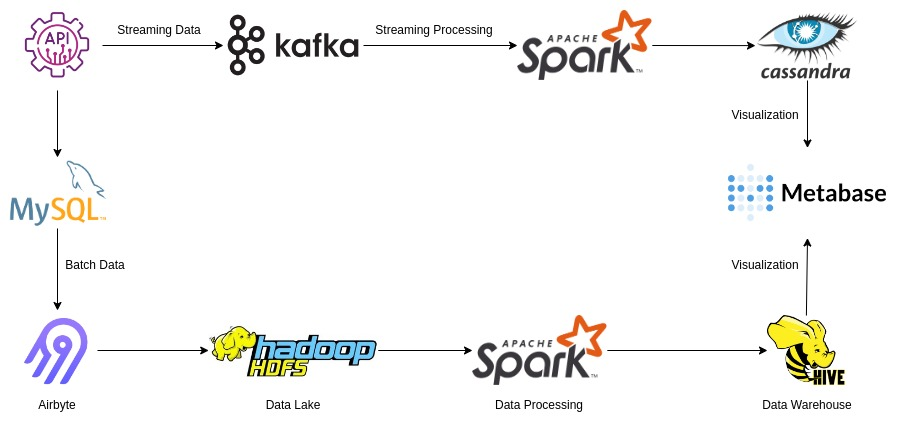

# Big-Data-Pipeline-Open-Source-Stack
This project demonstrates a scalebale big data pipeline developed using open source technologies. We tried to imitate an Ecommerce website where the APIs will be producing data in Batches and as a Stream. We will be using open sources tools to build the data pipelines and ETL layers. 

## Architecture

The data source for the project is an API(imitatte Ecommerce website) that repeatedly produce orders and click-stream data. The real-time orders are stored in MySQL databases (OLTP) and extracted in batches to ingest in the Hadoop HDFS (OLAP), which is used as a Data Lake. Periodically raw data from the Data-Lake is extracted and transformed and laoded in Hive distributed Data Warehouse system to analyze large scale data. The streaming APIs produce distirbuted click-stream using Kafka which is processed in real-time using Apache Spark and stored in Cassandra Distributed Databases. Both batch and streaming data is visualized using open sources visualization tool Metabase.  

<p align="center">
	
</p>

## API

The API for this project consists of both REST APIs and Streaming APIs. The rest APIs produces random orders data and store them in the eCommerce database. ```orders``` table in the database has the orders data and ```completed_orders``` table has those orders that were completed. The Streaming APIs produces random data of those user who have viewed random products on the Ecommmerce website and those users who have checked the status of their orders which are not delivered.

### Database setup instructions:

1. Run MySQL on terminal using the command "mysql -u ```<your-username>``` -p". When prompted, enter the password.
2. Create a database named "eCommerce". 
3. In eCommerce database create tables: 
    
    ```
    CREATE TABLE user(
        id INT(255) NOT NULL PRIMARY KEY AUTO_INCREMENT, 
        name VARCHAR(255) NOT NULL,  
        address VARCHAR(255)
    ); 
    
    CREATE TABLE products(
        product_id INT(255) NOT NULL PRIMARY KEY AUTO_INCREMENT, 
        category VARCHAR(255) NOT NULL, 
        name VARCHAR(255)
    );
    
    CREATE TABLE orders(
        order_id int(255) NOT NULL PRIMARY KEY AUTO_INCREMENT, 
        user_id int(255) NOT NULL, 
        product_id int(255) NOT NULL, 
        orderedAt TIMESTAMP DEFAULT CURRENT_TIMESTAMP(), 
        status ENUM('0','1') DEFAULT '0', 
        FOREIGN KEY (user_id) REFERENCES user(id), 
        FOREIGN KEY (product_id) REFERENCES products(product_id)
    );

    CREATE TABLE completed_orders(
        order_id int(255) NOT NULL PRIMARY KEY, 
        completedAt TIMESTAMP DEFAULT CURRENT_TIMESTAMP(), 
        status ENUM('0','1') DEFAULT '1', 
        FOREIGN KEY (order_id) REFERENCES orders(order_id) 
    );
    ```

### Running the APIs:

To produce orders data we have run the following files:

```
python3 src/api/rest_api.py
python3 src/api/create_orders.py
python3 src/api/updated_orders.py
```

To produce streaming data we have run the following file:

```
python3 src/stream/stream_producer.py
```


## Streaming Data

### Kafka Setup Instructions:

- Create topics for click-stream data: productview and orderview
```
    bin/kafka-topics.sh --create --topic productview --bootstrap-server localhost:9092 --replication-factor 1 --partitions 4	
    bin/kafka-topics.sh --create --topic orderview --bootstrap-server localhost:9092 --replication-factor 1 --partitions 4	
```

### Processing Streaming Data:


## Batch Data

### Setup Airbyte


## Data Lake and Warehouse

### Setup Data Lake and Warehouse


### Load data from Daata Lake to Warehouse


## Dashboard

